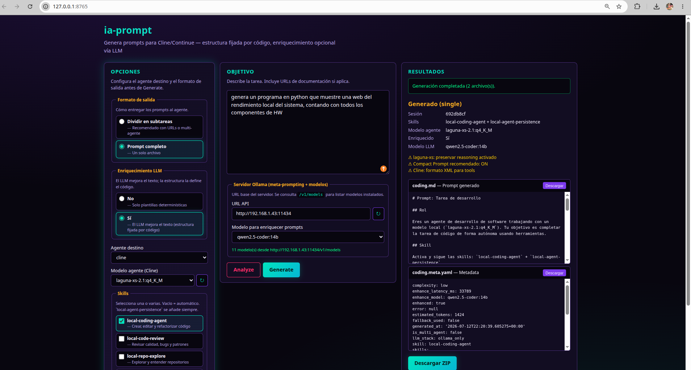

# ia-prompt

Generador de prompts optimizados para agentes locales (**Cline** / **Continue**).

Combina **plantillas determinísticas** (estructura fijada por código) con **enriquecimiento opcional vía LLM** (detalle y criterios medibles).

## Video demo


[](https://youtu.be/PrPnJIvInmw)

[Ver en YouTube → ia-prompt: divide y vencerás para IAs locales](https://youtu.be/PrPnJIvInmw)

## Instalación

```bash
cd ia-prompt
python3 -m venv .venv
source .venv/bin/activate
pip install -e .
```

Configura la IP del servidor en:
- `config/prompt-generator.yaml` → `api_base`
- `../config/server-endpoints.yaml` → endpoints compartidos del stack

## Uso rápido

```bash
# Analizar objetivo (sin generar)
ia-prompt analyze -o "Implementar API REST con doc https://..."

# Secuencial (por defecto si hay URLs o multi-agente)
ia-prompt generate -o "Implementar dos agentes A2A https://..." --agent cline

# Secuencial + enriquecimiento LLM en cada tarea
ia-prompt generate -o "..." --agent cline --auto-enhance

# Prompt único (modo anterior)
ia-prompt generate -o "Refactorizar auth.ts" --agent cline --single

# Forzar enriquecimiento siempre
ia-prompt generate -o "..." --enhance
```

## Salida

### Modo secuencial (recomendado)

```
prompts/generated/<tipo>/sequence/
├── 00-INDEX.md          # Orden de ejecución
├── 01-research.md       # Tarea 1
├── 02-scaffold.md       # Tarea 2
├── ...
└── sequence.meta.yaml   # Metadata
```

**Cline:** un chat nuevo por cada `NN-*.md`, en orden.

### Modo único (`--single`)

```
prompts/generated/<tipo>.md
prompts/generated/<tipo>.meta.yaml
```

## Cuándo se invoca el LLM

| Flag | Modo secuencial | Modo `--single` |
|------|-----------------|-----------------|
| *(ninguna)* | No | No |
| `--no-enhance` | No | No |
| `--enhance` | Sí (cada tarea) | Sí |
| `--auto-enhance` | Sí si tarea compleja/vaga | Sí si tarea compleja/vaga |

**Modelo meta-prompting:** `qwen2.5-coder:14b` (fallback: `gemma3:12b`) en `config/prompt-generator.yaml`.

El LLM **no redefine la estructura**: valida que se conserven título `Tarea N/M`, secciones, `@url`, Stack y placeholders.

## Perfiles secuenciales

| Perfil | Tareas | Cuándo |
|--------|--------|--------|
| `full` | 5 | Multi-agente o URLs + alta complejidad |
| `with_urls` | 3 | URLs sin multi-agente |
| `simple` | 2 | Código simple |

```bash
ia-prompt generate -o "..." --profile full
```

## Estructura del paquete

```
ia-prompt/
├── config/prompt-generator.yaml   # Config de la herramienta
├── docs/arquitectura.md           # Documentación técnica
├── prompts/
│   ├── templates/                 # Plantillas por tipo de tarea
│   ├── fragments/                 # Fragmentos reutilizables
│   ├── sequences/                 # Plantillas por paso secuencial
│   └── generated/                 # Salida
├── web/                          # WebUI (HTML + static)
│   ├── index.html
│   └── static/
├── pyproject.toml
└── src/ia_local_prompt/           # Código Python
    ├── service.py                 # Lógica compartida CLI + WebUI
    ├── webapp.py                  # FastAPI
    └── ...
```

Configs compartidos del stack (modelos, endpoints) en `../config/`.

## WebUI

Interfaz web para analyze/generate sin terminal:

```bash
ia-prompt serve
# o
ia-prompt-web
```

Abre http://127.0.0.1:8765

- Selección de servidor y modelo LLM (meta-prompting)
- Textarea de objetivo + botones **Analyze** / **Generate**
- Panel de opciones (agente, modelo, skill, modo secuencial, enrich)
- Vista previa y descarga individual o ZIP

## Documentación

- [Arquitectura y módulos](docs/arquitectura.md)

