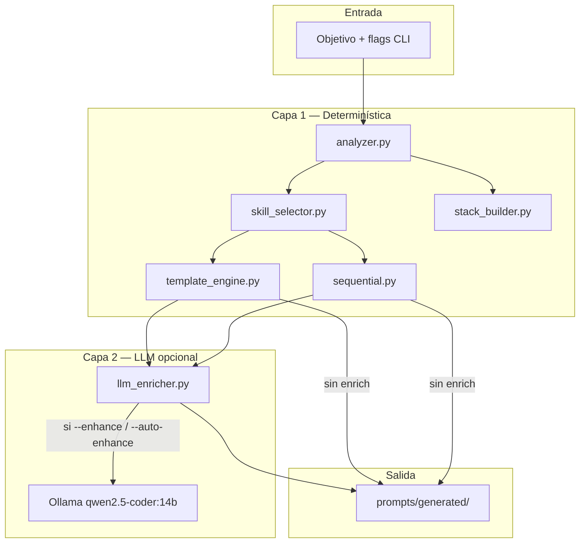

# Arquitectura de ia-prompt

## Visión general

`ia-prompt` es un pipeline de **dos capas**:



**Principio:** el código fija **qué secciones existen** y **en qué orden**; el LLM solo **enriquece el contenido** sin romper la estructura.

---

## Módulos

| Módulo | Responsabilidad |
|--------|-----------------|
| `cli.py` | Comandos `generate` y `analyze`; orquesta el pipeline |
| `analyzer.py` | Clasifica tarea, URLs, multi-agente, stack LLM, complejidad |
| `skill_selector.py` | Elige skill, modelo y plantilla según `models-registry.yaml` |
| `template_engine.py` | Render Jinja2: plantillas + fragmentos → borrador |
| `sequential.py` | Construye secuencia de tareas (`01-research` … `05-finalize`) |
| `stack_builder.py` | Bloque `## Stack` (Ollama dual, etc.) |
| `llm_enricher.py` | Meta-prompting + validación post-LLM |
| `optimizer.py` | Ajustes finales y warnings |
| `exporters.py` | Escribe `.md` y `.meta.yaml` |
| `service.py` | Lógica compartida CLI + WebUI (analyze, generate) |
| `webapp.py` | API FastAPI + WebUI estática |

---

## WebUI

```bash
ia-prompt serve --host 127.0.0.1 --port 8765
```

| Endpoint | Método | Descripción |
|----------|--------|-------------|
| `/` | GET | Interfaz HTML |
| `/api/config` | GET | Modelos, servidores, opciones |
| `/api/analyze` | POST | Analiza objetivo |
| `/api/generate` | POST | Genera prompt(s) |
| `/api/download/{session}/zip` | GET | Descarga ZIP |
| `/api/download/{session}/{file}` | GET | Descarga archivo |

La estructura de los prompts la fija siempre `service.py` + plantillas; el LLM solo enriquece si `enhance_mode` es `on` o `auto`.

---

## Flujo `generate`

### 1. Análisis (`analyzer.py`)

Extrae del objetivo:
- Tipo: `coding`, `repo_explore`, `security_review`, …
- URLs (`https://...`)
- Multi-agente (A2A, "dos agentes", …)
- Stack LLM (`ollama_only` por defecto en multi-agente)
- Complejidad: `low` | `medium` | `high`

### 2. Selección (`skill_selector.py`)

Lee `../config/models-registry.yaml`:
- Modelo destino (ej. `qwen3-coder:30b`)
- Skill (ej. `local-coding-agent`)
- Plantilla base (`coding-task.md`)

### 3. Modo de salida

| Condición | Modo |
|-----------|------|
| `--single` | Prompt único |
| `--sequential` o `sequential_default: true` + URLs/multi-agente | Secuencial |
| Resto | Secuencial si `sequential_default` y criterios |

### 4. Capa determinística

**Prompt único:**
1. `render_prompt()` → plantilla + fragmentos
2. `assemble_agent_message()` → `@url` + Stack + cuerpo

**Secuencial:**
1. `build_sequence()` → N pasos desde `prompts/sequences/`
2. `render_sequence_index()` → `00-INDEX.md`

### 5. Capa LLM (`llm_enricher.py`)

Solo si `--enhance`, `--auto-enhance` (y no `--no-enhance`).

| Modo | Función | Meta-prompt |
|------|---------|-------------|
| Único | `enrich_prompt()` | `META_PROMPT_TEMPLATE` |
| Secuencial | `enrich_sequence_step()` × N | `SEQ_META_PROMPT_TEMPLATE` |

**Validación post-LLM** — si falla, se conserva el borrador determinístico:

- Prompt único: secciones `criterios`, `skill`, `persistencia`; `@url` y `## Stack`
- Secuencial: `Tarea N/M`, `Modo secuencial`, `Qué hacer`, `Qué NO hacer`, archivo siguiente

### 6. Exportación (`exporters.py`)

Escribe en `prompts/generated/`.

---

## Plantillas

### `prompts/templates/`
Plantilla por tipo de tarea (`coding-task.md`, `repo-exploration.md`, …).

### `prompts/fragments/`
Bloques inyectados condicionalmente:
- `cline-preamble.md` — `@url` + límite de lecturas
- `phase-gate.md` — FASE 1 → FASE 2
- `web-fetch-cline.md` — tools correctas (`fetch_web_content`, `firecrawl_scrape`)
- `stack-*.md` — configuración Ollama/vLLM
- `plan-multi-agent.md` — plan A2A

### `prompts/sequences/`
Un archivo por paso secuencial. Variables Jinja: `step_num`, `step_total`, `next_file`, `objective`, `stack`, …

---

## Configuración

### `ia-prompt/config/prompt-generator.yaml`

```yaml
prompt_generator:
  model: qwen2.5-coder:14b      # meta-prompting
  fallback_model: gemma3:12b
  api_base: http://SERVER:11434
  timeout_seconds: 300

agent_message:
  sequential_default: true
  research_fetch_limit: 3
  secondary_ollama_model: laguna-xs-2.1:q4_K_M
```

### `../config/` (workspace IA-Local)

- `models-registry.yaml` — modelos y skills
- `server-endpoints.yaml` — IPs Ollama/vLLM

---

## Perfiles secuenciales

Definidos en `sequential.py` → `_STEP_PROFILES`:

**`full` (5 tareas):**
1. `01-research` — Solo leer docs → `## PLAN DE IMPLEMENTACIÓN`
2. `02-scaffold` — `requirements.txt`, estructura
3. `03-implement` — Código principal
4. `04-verify` — Demo y pruebas
5. `05-finalize` — README y cierre

**`with_urls` (3 tareas):** research → implement → verify

**`simple` (2 tareas):** implement → verify

---

## CLI — referencia

```
ia-prompt analyze -o "objetivo"
ia-prompt generate -o "objetivo" [opciones]

Opciones principales:
  -a, --agent cline|continue
  -m, --model MODELO
  --enhance              Siempre enriquecer con LLM
  --auto-enhance         Enriquecer si complejidad alta/vaga
  --no-enhance           Nunca LLM
  --single               Prompt único
  --sequential, --seq    Forzar secuencial
  -p, --profile full|with_urls|simple
  --enhance-model MODELO Override meta-prompting
```

---

## Extender la herramienta

### Añadir un paso secuencial
1. Crear `prompts/sequences/06-mi-paso.md`
2. Añadir entrada en `_STEP_PROFILES` del perfil deseado
3. Ajustar validación en `_validate_sequential_enriched` si hay requisitos nuevos

### Añadir fragmento
1. Crear `prompts/fragments/mi-fragmento.md`
2. Cargar desde `template_engine.py` o `sequential.py`

### Añadir tipo de tarea
1. Extender `TaskType` en `analyzer.py`
2. Añadir defaults en `models-registry.yaml`
3. Crear plantilla en `prompts/templates/`
